# Inventory Management System — Frontend

A multi-tenant inventory management platform for tracking products, stock, orders, and returns across an organization — built as a full-featured portfolio project.

This is the **frontend (UI)** repository. The backend/API lives in a separate repo.

**🔗 Live demo:** [https://i-inventix.vercel.app/login](https://i-inventix.vercel.app/login)

---

## Screenshots

<p align="center">
  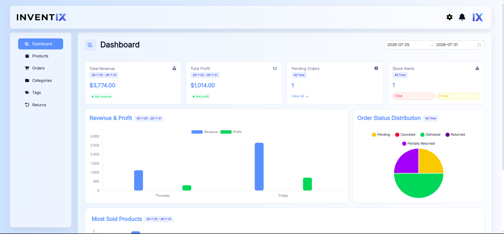
  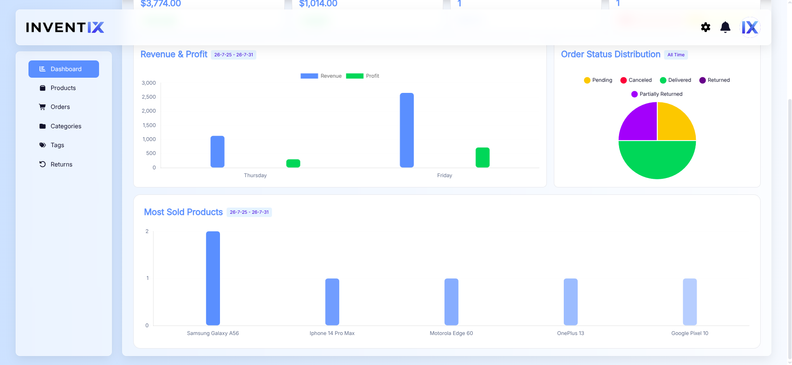
</p>
<p align="center">
  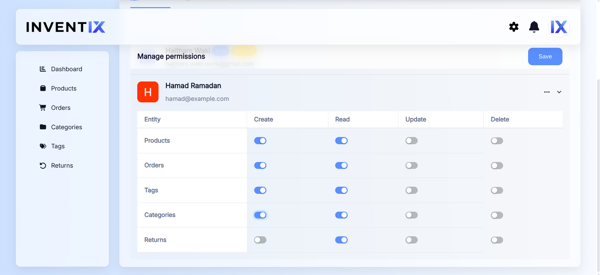
  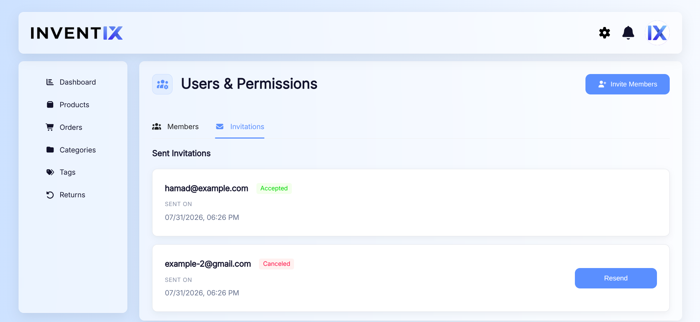
</p>
<p align="center">
  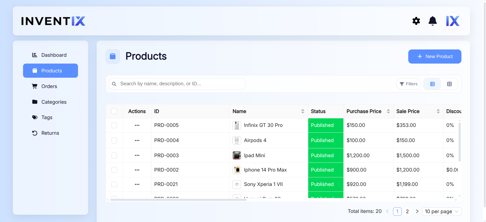
  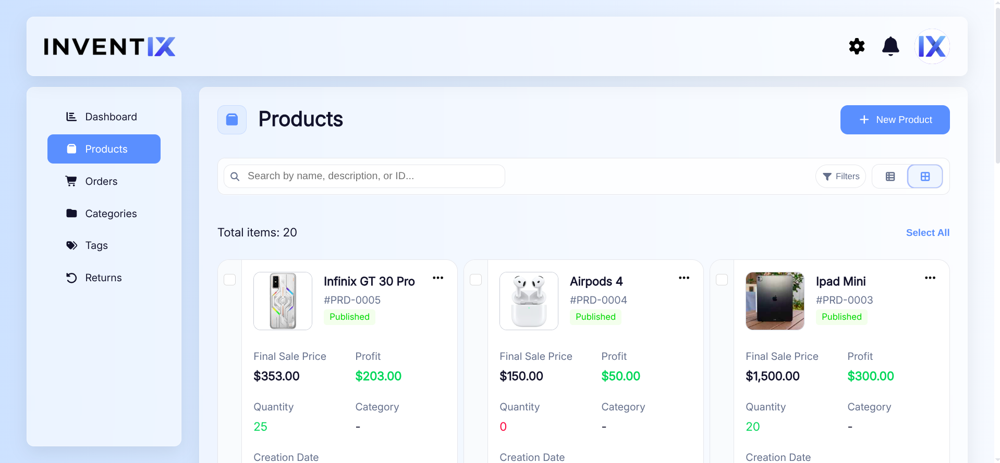
  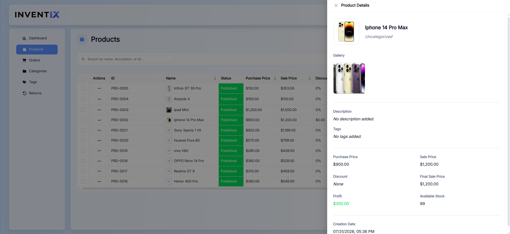
  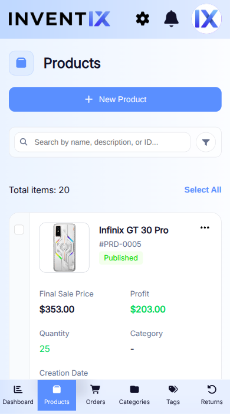
</p>
<p align="center">
  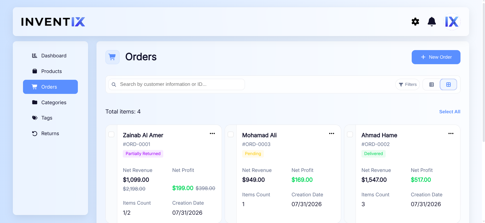
  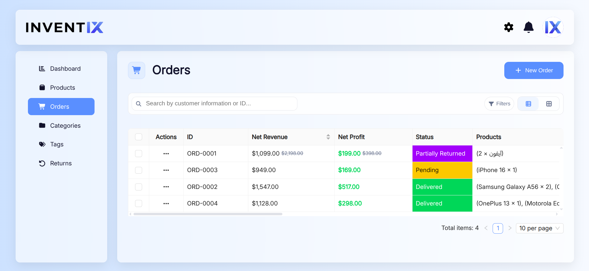
</p>
<p align="center">
  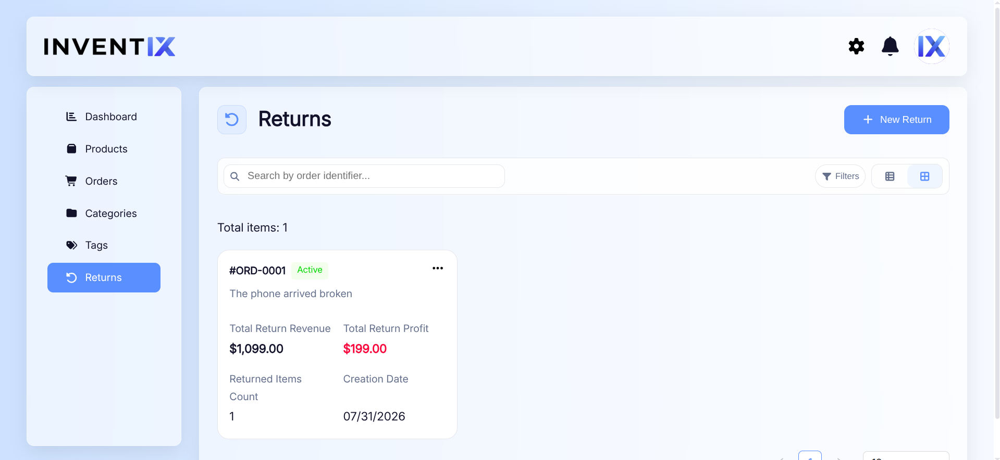
</p>

<!--
  Add your images to docs/screenshots/ in the repo and update the
  filenames/captions above. GIFs work the same way (e.g. login-flow.gif)
  and will auto-play on GitHub.
-->

## Overview

The app lets an organization manage its full inventory lifecycle: products, categories, tags, orders, and returns, with role-based access control, team invitations, a stats dashboard, and bilingual (English/Arabic) support with full RTL layout.

## Features

- **Dashboard** — KPI cards and charts (revenue & profit trends, orders overview, top-selling products) powered by Chart.js
- **Products** — full CRUD, image uploads with cropping, categories and tags
- **Orders** — order management with status tracking
- **Returns** — return management mirroring the order workflow (read/detail drawers, item-level breakdown)
- **Categories & Tags** — CRUD with filtering
- **Users & Permissions** — role-based access control (Owner / Admin / Member) with granular per-entity CRUD permissions, team member invitations, and an org-join flow via invite links
- **Authentication** — email/password signup with email verification, Google OAuth login, forgot/reset password flow
- **Settings** — general, inventory, and security settings
- **Internationalization** — English and Arabic, including full RTL layout switching (Ant Design + custom styling), and native timezone localization via `Intl.DateTimeFormat`
- **Responsive design** — adapts across desktop and mobile breakpoints

## Tech Stack

| Category         | Tech                                                          |
| ---------------- | ------------------------------------------------------------- |
| Framework        | React 19 + TypeScript, Vite                                   |
| Routing          | React Router v7                                               |
| State management | Redux Toolkit + Redux Persist                                 |
| Forms            | React Hook Form                                               |
| Styling          | styled-components, custom theme (design tokens & breakpoints) |
| UI library       | Ant Design                                                    |
| Charts           | Chart.js / react-chartjs-2                                    |
| i18n             | react-i18next (English / Arabic)                              |
| Auth             | Google OAuth (`@react-oauth/google`), JWT-based session       |
| HTTP             | Axios                                                         |
| Other            | FontAwesome, dayjs, currency-codes, react-phone-number-input  |

## Architecture Notes

A few decisions worth calling out for anyone reviewing the code:

- **Custom component system** — rather than relying on raw HTML or Ant Design defaults directly, shared primitives (`Text`, `Image`, `Drawer`, `Icon`, `Table`, `Column`/`Row`, etc.) wrap the underlying library so typography, spacing, and RTL behavior stay consistent app-wide.
- **Data-driven UI over duplicated JSX** — read/detail views (e.g. `ProductReadDrawer`, `ReturnReadDrawer`) are built from a `sections` array config rather than hand-written repetitive markup, making them easier to extend.
- **Feature-based routing** — each domain (`products`, `orders`, `returns`, `categories`, `tags`, `users-permissions`, `settings`, `dashboard`) is a self-contained folder with its own components, utils, and route file, lazy-loaded via `React.lazy`.
- **Centralized permission checks** — a single `checkPermissions` utility derives CRUD access per entity from the current user's role and permission set, used consistently across private routes and UI actions.
- **Redux Toolkit slices per domain** — one slice + selector pair per feature (products, orders, returns, categories, tags, users, dashboard, settings, organization, app), keeping state colocated with the feature it serves.

## Getting Started

### Prerequisites

- Node.js 18+
- Yarn
- A running instance of the [backend API](https://github.com/Haitham-26/inventory-management-api)

### Installation

```bash
git clone git@github.com:Haitham-26/inventory-management-ui.git
cd inventory-management-ui
yarn
```

### Environment Variables

Create a `.env.development` file in the project root:

```env
VITE_BASE_URL=http://localhost:5173
VITE_BASE_API_URL=http://localhost:5000/api
VITE_GOOGLE_CLIENT_ID=your_google_oauth_client_id
VITE_GOOGLE_CLIENT_SECRET=your_google_oauth_client_secret
```

### Run locally

```bash
yarn dev
```

The app will be available at `http://localhost:5173`.

### Build for production

```bash
yarn build
yarn preview
```

## Available Scripts

| Command        | Description                          |
| -------------- | ------------------------------------ |
| `yarn dev`     | Start the Vite dev server            |
| `yarn build`   | Type-check and build for production  |
| `yarn lint`    | Run ESLint                           |
| `yarn preview` | Preview the production build locally |

## Deployment

Deployed on [Vercel](https://vercel.com), with SPA rewrites configured in `vercel.json` so client-side routing works correctly on refresh and direct navigation.

## Known Limitations

- **Transactional emails are disabled on the live demo.** Email sending (signup verification, invitations, forgot-password) is fully implemented in the backend, but the demo is hosted on a free tier that does not include a production email provider. As a result, verification/reset emails won't be delivered on the hosted version. This does **not** affect the underlying functionality — it works end-to-end when connected to a configured SMTP/email provider (e.g. locally, or on a production deployment with one set up).

## Project Structure

```
src/
├── components/     # Shared UI primitives (Text, Drawer, Table, Icon, etc.)
├── model/          # Domain types, per feature (product, order, return, user, ...)
├── redux/          # Redux Toolkit slices & selectors, per feature
├── routes/         # Feature-based route folders (dashboard, products, orders, returns,
│                   #   categories, tags, users-permissions, settings, auth flows)
├── locales/        # en.json / ar.json translation resources
├── theme/          # Design tokens & breakpoints
├── utils/          # Shared helpers (dates, strings, permissions, app routes)
└── axios/          # API client configuration
```

## Related Repository

- Backend / API — [https://github.com/Haitham-26/inventory-management-api](https://github.com/Haitham-26/inventory-management-api)

---

_This is a personal portfolio project built to demonstrate full-stack development skills, including RBAC, i18n/RTL support, and a scalable feature-based frontend architecture._
